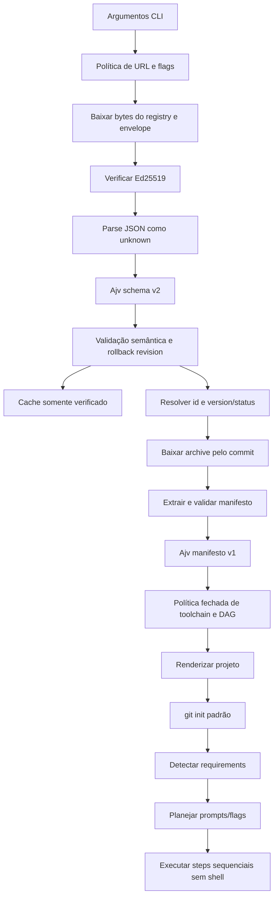

# Plano de hardening do CLI

## 1. Objetivo e status

Este documento transforma as decisões aprovadas para o `@jptecno/cli` em uma sequência executável de pull requests pequenos, ordenados e reversíveis. O plano cobre contrato, confiança, cache, seleção de versões, toolchain, requisitos, execução, UX, CI e harness.

O documento é um plano de implementação, não uma descrição do comportamento já disponível. A implementação atual ainda usa registry `schemaVersion: 1`, manifesto com `postCreate`, catálogo oficial via GitHub Raw, execução fixa de `npm install`/`npm run check`, CI somente em Ubuntu e PR-Agent.

O backlog posterior a este ciclo está isolado em [`../BACKLOG.md`](../BACKLOG.md) e não faz parte dos critérios de conclusão deste plano.

## 2. Regras de execução

1. Cada mudança deve ser feita em worktree e branch curta criada de `development`, conforme `AGENTS.md`.
2. Cada PR deve ser revisável isoladamente, preservar os limites entre `application`, `contracts`, `adapters` e `main.ts` e, quando aplicável, manter o caminho ainda não ativado atrás da composição.
3. Não publicar compatibilidade com os formatos experimentais antigos:
   - o registry aceito ao final será somente `schemaVersion: 2`;
   - o manifesto continuará com `schemaVersion: 1`, mas aceitará somente `toolchain`, nunca `postCreate`;
   - não inferir versão de schema pela presença de campos.
4. Schemas publicados são imutáveis. Correções incompatíveis exigem nova URL versionada e, quando o contrato mudar, novo `schemaVersion`.
5. Toda entrada externa deve chegar como `unknown`, ser validada na borda e só então convertida para tipos internos.
6. Nenhum dado de registry, manifesto, variável ou argumento pode chegar a um shell. O executor usa processo direto, sem `shell: true`.
7. Alterações de harness exigem a label manual `harness-change-approved`, além dos checks obrigatórios.
8. Gates mínimos de todo PR no `cli`:
   - testes específicos do fluxo alterado;
   - `npm run check`;
   - `npm pack --dry-run` quando houver impacto no conteúdo do pacote;
   - revisão da skill `review-template-security` quando houver alteração em registry, manifesto, download, archive, paths ou execução.
9. PRs de outros repositórios devem usar seus próprios gates e não ser misturados com mudanças do `cli`.
10. A ativação em produção só ocorre depois que schemas, templates, assinatura e GitHub Pages estiverem disponíveis e validados.

## 3. Escopo aprovado e requisitos rastreáveis

### 3.1 Registry e seleção

| ID       | Requisito                                                                                                                                                                                                |
| -------- | -------------------------------------------------------------------------------------------------------------------------------------------------------------------------------------------------------- |
| `REG-01` | O registry oficial usa `schemaVersion: 2`, `revision` inteiro monotônico e `publishedAt` em RFC 3339/UTC.                                                                                                |
| `REG-02` | Cada template mantém `versions[]` com histórico; versões são únicas por template e há exatamente uma versão `active`. As demais são `deprecated` ou `revoked`.                                           |
| `REG-03` | Versões não ativas têm `statusReason` não vazio. `replacement`, quando presente, referencia outro `id` existente cuja versão ativa não esteja revogada.                                                  |
| `REG-04` | Cada versão exige `version === ref`, tag SemVer estrita com prefixo `v` e `commit` hexadecimal minúsculo com 40 caracteres.                                                                              |
| `REG-05` | No registry oficial, todo `repository` pertence a `jptecno/*`. Registries customizados podem usar outros owners, sem relaxar as demais validações.                                                       |
| `REG-06` | `--template <id@version>` e `--template-version <version>` selecionam versão histórica. Se `--template` já contiver versão, uma `--template-version` divergente falha.                                   |
| `REG-07` | Selector e listagem mostram somente versões `active` por padrão. `--include-deprecated` inclui `deprecated`, nunca `revoked`.                                                                            |
| `REG-08` | Uso de versão `deprecated` exige confirmação interativa específica ou `--allow-deprecated-template`. Versão `revoked` nunca materializa, renderiza nem executa comandos, mesmo se pedida explicitamente. |
| `REG-09` | O archive do template é solicitado pelo `commit` autenticado, não por `ref`; os limites de tamanho, razão de descompressão, traversal e links simbólicos continuam obrigatórios.                         |

### 3.2 Schemas e validação

| ID       | Requisito                                                                                                                                                                     |
| -------- | ----------------------------------------------------------------------------------------------------------------------------------------------------------------------------- |
| `SCH-01` | Os JSON Schemas canônicos do registry v2 e do manifesto v1 ficam no `template-registry`, em URLs versionadas e imutáveis.                                                     |
| `SCH-02` | O `cli` mantém cópias vendorizadas byte a byte e possui gate que detecta divergência em relação aos schemas canônicos fixados.                                                |
| `SCH-03` | Ajv em modo estrito valida registry e manifesto em runtime antes de qualquer validação semântica ou uso. Campos desconhecidos são rejeitados quando o schema não os declarar. |
| `SCH-04` | O manifesto permanece em `schemaVersion: 1`, substitui `postCreate` por `toolchain` e não oferece parser de compatibilidade para `postCreate`.                                |

### 3.3 Toolchain, steps e requirements

| ID       | Requisito                                                                                                                                                                                                             |
| -------- | --------------------------------------------------------------------------------------------------------------------------------------------------------------------------------------------------------------------- |
| `TOL-01` | Os únicos ecosystems aceitos são `node`, `go`, `flutter`, `rust`, `ruby` e `python`.                                                                                                                                  |
| `TOL-02` | Executáveis permitidos por ecosystem: `node:npm`, `go:go`, `flutter:flutter,dart`, `rust:cargo`, `ruby:bundle`, `python:uv`.                                                                                          |
| `TOL-03` | Comandos têm executável e `args[]` estruturados. Não há string de shell, interpretador genérico nem placeholders em executável ou argumentos.                                                                         |
| `TOL-04` | Uma política fechada relaciona ecosystem, step, executável, subcomandos e flags. Tudo que não estiver explicitamente permitido falha no parse sem executar processo.                                                  |
| `TOL-05` | Steps opcionais possíveis: `install`, `formatCheck`, `lint`, `typecheck`, `test` e `build`; o manifesto declara ao menos um.                                                                                          |
| `TOL-06` | Cada step declara explicitamente `dependsOn: []` ou suas dependências e `recommended: boolean`. Dependências só apontam para steps declarados e o grafo não contém ciclos.                                            |
| `TOL-07` | A execução é sequencial. A ordem topológica usa, como desempate, `install`, `formatCheck`, `lint`, `typecheck`, `test`, `build`.                                                                                      |
| `TOL-08` | Recusa, bloqueio de requisito ou falha de um step ignora todos os dependentes em cascata, continua steps independentes e produz exit code diferente de zero quando houve falha ou solicitação explícita não atendida. |
| `REQ-01` | `requirements` são estruturados por ecosystem, usam somente ferramentas da allowlist e aceitam apenas `minimumVersion`; intervalos, máximo e comandos livres não são aceitos.                                         |
| `REQ-02` | Ferramenta ausente ou abaixo da versão mínima não bloqueia scaffolding/renderização; bloqueia somente os steps que precisam dela e seus dependentes.                                                                  |
| `REQ-03` | Uma flag explícita cuja execução seja impedida por requisito ausente, dependência recusada/bloqueada ou falha termina com exit code diferente de zero.                                                                |

### 3.4 UX e Git

| ID       | Requisito                                                                                                                                                                                       |
| -------- | ----------------------------------------------------------------------------------------------------------------------------------------------------------------------------------------------- |
| `UX-01`  | Sem flags de execução e com terminal interativo, a CLI pergunta por cada step em ordem, usando `[Y/n]` para `recommended: true` e `[y/N]` para `false`.                                         |
| `UX-02`  | Sem flags de execução e sem terminal interativo, nenhum step de toolchain é executado. O scaffolding ainda pode concluir.                                                                       |
| `UX-03`  | `--install` solicita somente `install`; `--no-install` não pergunta por `install`.                                                                                                              |
| `UX-04`  | `--validate` solicita os steps declarados entre `formatCheck`, `lint`, `typecheck`, `test` e `build`, sem exigir `install` quando o DAG não tiver essa dependência.                             |
| `UX-05`  | `--no-install --validate` executa validações independentes, bloqueia as dependentes de `install` e retorna exit code diferente de zero se qualquer validação solicitada não puder ser atendida. |
| `UX-06`  | Combinações contraditórias de flags falham no parsing com erro acionável em português brasileiro.                                                                                               |
| `GIT-01` | `git init` permanece habilitado por padrão e separado da toolchain do manifesto; `--no-git` continua desabilitando-o.                                                                           |

### 3.5 Assinatura, transporte e cache

| ID       | Requisito                                                                                                                                                                                                                       |
| -------- | ------------------------------------------------------------------------------------------------------------------------------------------------------------------------------------------------------------------------------- |
| `SIG-01` | O registry oficial é servido por GitHub Pages como bytes assinados por Ed25519, com envelope detached capaz de carregar múltiplas assinaturas.                                                                                  |
| `SIG-02` | O pacote do CLI contém keyring público oficial. O envelope é aceito quando ao menos uma assinatura corresponde aos bytes exatos e a uma chave confiável; chaves desconhecidas ou assinaturas duplicadas não aumentam confiança. |
| `SIG-03` | A assinatura é verificada antes de decodificar ou fazer parse do JSON do registry. Limites de tamanho são aplicados ao registry e ao envelope.                                                                                  |
| `SIG-04` | Registry customizado exige URL HTTPS, chave pública Ed25519 explícita e assinatura. A URL padrão da assinatura é `<registry-url>.sig`; uma flag pode sobrescrevê-la, também somente com HTTPS. URLs `file:` não são aceitas.    |
| `SIG-05` | Owners livres são permitidos somente no contexto customizado autenticado pela chave fornecida; o contexto oficial aplica `jptecno/*`.                                                                                           |
| `CAC-01` | Somente bytes cuja assinatura, schema e semântica foram validados entram no cache. A chave do cache inclui URL e identidade da raiz de confiança.                                                                               |
| `CAC-02` | Fallback para cache ocorre somente em erro de rede/timeout/indisponibilidade HTTP. Assinatura inválida, schema inválido, semântica inválida ou rollback de revisão falham fechados e não consultam fallback.                    |
| `CAC-03` | TTL é de sete dias, calculado a partir do instante local de verificação bem-sucedida; `publishedAt` não substitui esse instante.                                                                                                |
| `CAC-04` | Cache stale exige confirmação interativa ou flag explícita. Em modo não interativo, ausência da flag falha.                                                                                                                     |
| `CAC-05` | Criar projeto com cache stale exige consentimento adicional e distinto do consentimento para usar o registry stale; automação precisa de flag adicional explícita.                                                              |
| `CAC-06` | O CLI persiste a maior `revision` já aceita por URL/raiz de confiança e rejeita qualquer revisão inferior, ainda que corretamente assinada. O marcador só avança após todas as validações.                                      |

### 3.6 Harness

| ID       | Requisito                                                                                                                                                                                             |
| -------- | ----------------------------------------------------------------------------------------------------------------------------------------------------------------------------------------------------- |
| `HAR-01` | `AGENTS.md` permanece a fonte canônica; skills, instruções Copilot, agentes/comandos Claude e prompts apenas operacionalizam ou apontam para essas regras, sem criar uma segunda política divergente. |
| `HAR-02` | O harness local é determinístico e cobre regras Semgrep, políticas Danger, `harness-change-approved`, hooks e Lefthook contextual.                                                                    |
| `HAR-03` | Lefthook mantém validação contextual em pre-commit e executa `npm run check` em pre-push.                                                                                                             |
| `HAR-04` | CI executa o gate funcional em Ubuntu, Windows e macOS e preserva checks obrigatórios estáveis para o ruleset.                                                                                        |
| `HAR-05` | Semgrep CE continua com regras locais e reviewdog no PR; Danger continua aplicando políticas do PR a partir de base confiável.                                                                        |
| `HAR-06` | PR-Agent é removido por completo, inclusive workflow, configuração, prompt específico e segredo sem uso.                                                                                              |

## 4. Arquitetura-alvo resumida

A aplicação conhece modelos validados, seleção, política, DAG e resultados. Adapters cuidam de HTTPS, assinatura criptográfica, cache em disco, terminal, detecção de ferramentas, processo e archive. `src/main.ts` apenas compõe dependências e traduz saída/exit code.

## 5. Estratégia de rollout sem compatibilidade publicada

O rollout usa endpoints separados para evitar quebrar o CLI já publicado e, ao mesmo tempo, evitar um release final com dois formatos:

1. O `template-registry` publica schemas imutáveis e prepara GitHub Pages sem trocar o endpoint atual do CLI.
2. O `cli` adiciona e testa os componentes v2 sem ligá-los ao endpoint oficial em produção.
3. Templates recebem novo manifesto `schemaVersion: 1` com `toolchain` em novas tags imutáveis; tags antigas não são reescritas.
4. O `template-registry` publica e assina o catálogo v2 no endpoint Pages.
5. Um PR de ativação do `cli` troca a composição e a URL padrão, remove o parser/caminho antigo e é liberado.
6. O endpoint antigo pode permanecer congelado apenas para versões antigas do pacote; o novo CLI não contém fallback para ele.

Não deve haver janela em que o novo CLI busque um registry v1 ou aceite `postCreate`.

## 6. Sequência de PRs

### PR 01 — `cli`: baseline determinístico do harness e CI multiplataforma

**Objetivo:** endurecer os gates antes das mudanças funcionais e remover revisão não determinística.

**Requisitos:** `HAR-01` a `HAR-06`.

**Arquivos prováveis:**

- `.github/workflows/ci.yml`, `.github/workflows/static-analysis.yml`, `.github/workflows/pr-policy.yml`;
- remoção de `.github/workflows/ai-review.yml`, `.pr_agent.toml`, `.github/pr-agent.md`;
- `package.json`, `package-lock.json`, `lefthook.yml`, `dangerfile.ts`;
- `scripts/agent-hooks/*`, `scripts/danger/*` e novos scripts focados em `scripts/harness/`;
- `tests/scripts/**`, `.semgrep/rules/**`;
- `AGENTS.md`, `.github/copilot-instructions.md`, `.github/agents/**`, `.github/instructions/**`, `.github/prompts/**`, `.claude/agents/**`, `.claude/commands/**`, `.claude/settings.json`;
- `.github/pull_request_template.md`, `CONTRIBUTING.md` e `docs/harness-improvements.md`.

**ACs:**

1. `npm run check` roda localmente sem depender de token, LLM ou serviço de revisão.
2. O workflow funcional executa lint, typecheck, testes e build em `ubuntu-latest`, `windows-latest` e `macos-latest`.
3. Existe um job agregador com nome estável para o ruleset; uma falha em qualquer SO o reprova.
4. Semgrep valida/testa regras locais, produz achados para reviewdog em PR interno e falha independentemente da publicação do comentário.
5. Danger usa política confiável da base e o gate `harness-change-approved` cobre todos os arquivos de harness.
6. Pre-commit valida somente arquivos relevantes; pre-push executa `npm run check`.
7. Não resta referência a PR-Agent nem ao segredo `OPENAI_KEY`.

**Testes/gates:** `npm run check`, testes de `tests/scripts/**`, teste das regras Semgrep, execução de CI nos três SOs e `npm pack --dry-run` se scripts empacotados forem alterados.

**Dependências externas:** atualização manual do ruleset para o nome do job agregador e remoção de `OPENAI_KEY` dos secrets após o merge.

**Riscos:** diferenças de quoting/path no Windows; required check renomeado pode bloquear ou liberar merge indevidamente.

**Rollback:** restaurar o workflow anterior e o nome antigo do required check em conjunto. Não restaurar PR-Agent automaticamente; sua remoção é uma decisão aprovada.

---

### PR 02 — `template-registry`: schemas canônicos e publicação imutável

**Objetivo:** estabelecer a fonte de verdade antes do código consumidor.

**Requisitos:** `REG-01` a `REG-05`, `SCH-01`, `SCH-04`, `TOL-01` a `TOL-06`, `REQ-01`.

**Arquivos prováveis no outro repositório:**

- novos `schemas/registry/v2/registry.schema.json` e `schemas/manifest/v1/template.schema.json`;
- fixtures válidas/inválidas em `schemas/fixtures/**`;
- `scripts/validate-registry.mjs`, `scripts/validate-registry.test.mjs` e scripts específicos de schema/imutabilidade;
- `.github/workflows/validate.yml` e novo workflow de Pages;
- `README.md` e documentação de publicação.

**ACs:**

1. O schema do registry expressa estrutura, formatos e condicionais de status; validações cross-entry ficam documentadas para o validator semântico.
2. O schema do manifesto v1 contém `toolchain` e rejeita `postCreate`, shell strings, executáveis fora da allowlist e propriedades inesperadas.
3. Fixtures cobrem todos os ecosystems, todos os steps, DAG válido/inválido, status e histórico.
4. URLs de schema contêm a versão e um artefato já publicado não pode ser sobrescrito pelo workflow.
5. O registry de produção ainda não muda neste PR.

**Testes/gates:** testes do validator, validação de todas as fixtures, teste de referências `$id`/`$ref`, teste de publicação Pages em dry run e verificação de que o working tree gerado é reproduzível.

**Dependências externas:** GitHub Pages habilitado no `template-registry`.

**Riscos:** schema excessivamente permissivo cria bypass; schema excessivamente restritivo impede comandos legítimos.

**Rollback:** reverter o workflow antes da primeira publicação. Depois de publicado, nunca alterar o artefato; publicar uma versão corretiva em nova URL/schemaVersion.

---

### PR 03 — `cli`: infraestrutura Ajv e vendoring de schemas

**Objetivo:** criar a única porta de validação estrutural, ainda sem ativar o registry oficial v2.

**Requisitos:** `SCH-02`, `SCH-03`.

**Arquivos prováveis:**

- `package.json`, `package-lock.json` para Ajv;
- novos `src/application/validate-external-document.ts` e módulos de erro específicos;
- cópias em `src/schemas/registry-v2.schema.json` e `src/schemas/template-manifest-v1.schema.json`, ou diretório equivalente incluído explicitamente no build/pacote;
- script `scripts/verify-vendored-schemas.mjs` com origem e digest fixados;
- `tsconfig.json`/build somente se necessário para copiar assets ao `dist`;
- novos testes em `tests/application/` e `tests/scripts/`.

**ACs:**

1. Ajv compila ambos os schemas em modo estrito durante teste/build.
2. Entrada inválida gera erro curto e acionável em PT-BR, sem ecoar documento completo, URLs autenticadas ou segredo.
3. O gate de vendoring falha se bytes/digest não corresponderem ao schema canônico fixado.
4. `npm pack --dry-run` comprova que os schemas necessários em runtime estão presentes e nenhum arquivo extra foi incluído.
5. Nenhum parser antigo é usado para aceitar parcialmente um documento que o Ajv rejeitou.

**Testes/gates:** testes de tipo primitivo/array, campo ausente, adicional, enum, formato, tamanho e erro sanitizado; `npm run check`; `npm pack --dry-run`.

**Dependência:** PR 02 publicado ou commit canônico fixado.

**Riscos:** schema não copiado para `dist`; mensagens Ajv vazarem conteúdo externo.

**Rollback:** remover Ajv e assets vendorizados enquanto o caminho ainda não estiver ativado.

---

### PR 04 — `cli`: modelo e semântica do registry v2

**Objetivo:** validar histórico, status, owners e resolver seletores sem rede.

**Requisitos:** `REG-01` a `REG-08` e `SCH-03`.

**Arquivos prováveis:**

- `src/contracts/template-registry.types.ts`;
- `src/application/parse-template-registry.ts` ou substituto v2;
- novos `src/application/validate-template-registry.ts`, `resolve-template-version.ts` e `template-selector.types.ts`;
- `src/application/format-template-list.ts`;
- `tests/application/parse-template-registry.test.ts`, `format-template-list.test.ts` e novos testes de resolução.

**ACs:**

1. Ajv roda antes das regras cross-entry.
2. IDs, versões, commits, `revision`, `publishedAt`, unicidade, exatamente uma active e replacements são validados.
3. Contexto oficial rejeita owner diferente de `jptecno`; contexto customizado não aplica essa restrição.
4. Resolver padrão retorna somente active; `--include-deprecated` nunca torna revoked selecionável.
5. `id@version` e id + versão separada resolvem igual; conflito falha.
6. Deprecated retorna estado que exige autorização posterior; revoked falha antes do download.

**Testes/gates:** tabela completa de status, owner, SemVer, SHA40, duplicidades, replacement inexistente/revogado, selector e ordenação; `npm run check`.

**Riscos:** confundir ID de template com ID de versão; aplicar regra de owner oficial a custom registry.

**Rollback:** retirar módulos v2 ainda não compostos; não alterar o endpoint oficial.

---

### PR 05 — `template-registry`: assinatura Ed25519 e envelope detached

**Objetivo:** produzir registry v2 autenticado e rotacionável.

**Requisitos:** `SIG-01`, `SIG-02`, `SIG-03` e `SCH-01`.

**Arquivos prováveis no outro repositório:**

- schema versionado do envelope e fixtures criptográficas públicas;
- `scripts/sign-registry.mjs`, `scripts/verify-signature.mjs` e testes;
- `.github/workflows/validate.yml` e workflow de Pages;
- documentação de key IDs, rotação, emergência e separação entre chave privada e artefatos públicos.

**ACs:**

1. O envelope referencia algoritmo e key ID e suporta múltiplas assinaturas sobre os bytes exatos do registry.
2. A CI valida o registry antes de assinar e verifica novamente o par publicado.
3. Chaves privadas vêm exclusivamente de secrets/environment protegidos e nunca aparecem em artifact, log ou fork PR.
4. O workflow não assina código não confiável de PR e usa permissões mínimas.
5. Fixtures incluem assinatura válida, bytes alterados, chave desconhecida, assinatura malformada e rotação com duas assinaturas.

**Testes/gates:** testes criptográficos determinísticos com chaves de fixture, validação de workflow e smoke test do artefato Pages.

**Dependência:** PR 02.

**Riscos:** exfiltração de chave; normalização de newline alterar bytes; workflow assinar conteúdo não aprovado.

**Rollback:** interromper publicação e revogar/rotacionar a chave. Artefato assinado incorreto não deve substituir URL imutável; publicar nova revisão.

---

### PR 06 — `cli`: transporte autenticado oficial e customizado

**Objetivo:** verificar assinatura antes do parse e aplicar política HTTPS.

**Requisitos:** `SIG-01` a `SIG-05`.

**Arquivos prováveis:**

- evolução de `src/contracts/cli-ports.ts` para separar carregamento de bytes e validação;
- substituição/evolução de `src/adapters/github-registry-client.ts` por cliente HTTP neutro;
- novos `src/adapters/ed25519-registry-verifier.ts`, `src/application/registry-trust-policy.ts` e keyring oficial;
- `src/adapters/fetch-with-timeout.ts` para limites de bytes e erros classificados;
- `src/application/parse-cli-command.ts`, `run-cli.ts`, `src/main.ts` para flags de chave e override da assinatura;
- testes correspondentes em `tests/adapters/` e `tests/application/`.

**ACs:**

1. O cliente lê bytes com limite, baixa o envelope e verifica Ed25519 antes de `TextDecoder`, `JSON.parse` ou Ajv do registry.
2. O oficial funciona apenas com keyring embutido; custom exige chave explícita.
3. Custom usa `<url>.sig` por padrão e aceita override HTTPS explícito.
4. Registry ou assinatura `http:`, `file:` ou esquema desconhecido falha antes da rede/materialização.
5. Assinatura inválida, key ID desconhecido ou bytes alterados não chama parser, cache, template source nem executor.
6. Erros/logs não exibem chave completa, assinatura, URL autenticada ou corpo recebido.

**Testes/gates:** assinatura válida/inválida, ordem das chamadas, URLs, limites, redirects para esquema/host indevido, sanitização e flags; `npm run check`; `npm pack --dry-run`.

**Dependência:** PRs 03 e 05.

**Riscos:** parse acidental antes da verificação; keyring ausente do pacote; redirects burlarem HTTPS.

**Rollback:** manter o novo caminho fora da composição oficial até a ativação. Depois da ativação, rollback seguro exige voltar também ao endpoint anterior; nunca adicionar fallback unsigned.

---

### PR 07 — `cli`: cache verificado, stale e proteção contra rollback

**Objetivo:** permitir resiliência de rede sem transformar cache em bypass de confiança.

**Requisitos:** `CAC-01` a `CAC-06`.

**Arquivos prováveis:**

- novos contratos em `src/contracts/cli-ports.ts`;
- novos `src/application/load-trusted-registry.ts`, `registry-cache-policy.ts` e tipos de proveniência;
- novo adapter `src/adapters/file-registry-cache.ts`;
- `src/application/parse-cli-command.ts`, `run-cli.ts`, `src/adapters/readline-prompt.ts`, `src/main.ts`;
- novos `tests/application/load-trusted-registry.test.ts` e `tests/adapters/file-registry-cache.test.ts`.

**Política operacional:**

- cache verificado com até sete dias pode ser usado automaticamente como fallback de erro de rede;
- cache stale requer `--allow-stale-registry` em automação ou confirmação interativa;
- criação stale requer também `--allow-stale-template-creation` ou segundo consentimento interativo;
- erro de assinatura/schema/semântica/revision nunca usa cache;
- escrita usa arquivo temporário + rename atômico e permissões restritas quando suportadas.

**ACs:**

1. Entrada de cache contém bytes verificados, envelope/proveniência mínima, `verifiedAt`, revision, URL e fingerprint da confiança.
2. Cache truncado, adulterado ou com identidade diferente é ignorado com segurança e nunca executa template.
3. Apenas erros classificados como rede permitem fallback.
4. Os dois consentimentos stale são independentes e testáveis.
5. Revision menor que a maior aceita falha sem alterar cache/marcador; revision maior só avança o marcador depois de todas as validações.
6. Falha de escrita de cache não corrompe a última entrada válida nem mascara uma resposta de rede válida.

**Testes/gates:** relógio falso nos limites de sete dias, matriz rede versus confiança, modo TTY/não TTY, dois consentimentos, atomicidade, concorrência simples e rollback revision; `npm run check` nos três SOs.

**Dependência:** PR 06.

**Riscos:** diretórios de cache variam por SO; clock skew; TOCTOU; cache custom reutilizado com outra chave.

**Rollback:** desabilitar leitura/escrita de cache mantendo transporte assinado. Nunca fazer rollback para cache não verificado.

---

### PR 08 — `cli`: contrato de manifesto v1 com toolchain e política fechada

**Objetivo:** substituir `postCreate` por um contrato declarativo que não permita execução arbitrária.

**Requisitos:** `SCH-04`, `TOL-01` a `TOL-06`, `REQ-01`.

**Arquivos prováveis:**

- `src/contracts/template-manifest.types.ts`;
- `src/application/parse-template-manifest.ts`;
- novos `src/application/toolchain-policy.ts`, `validate-toolchain.ts` e `validate-step-dag.ts`;
- `src/application/create-project.ts` apenas para consumir o manifesto validado, sem ativar execução ainda;
- `tests/application/parse-template-manifest.test.ts` e novos testes de política/DAG.

**ACs:**

1. Ajv rejeita `postCreate`, zero steps, step desconhecido, `dependsOn` implícito, `recommended` ausente e propriedades extras.
2. Validação semântica rejeita ciclos, self-dependency, dependência ausente e dependência duplicada.
3. Ecosystem, executable, subcomando e cada flag passam por matriz fechada específica do step.
4. Shells, interpretadores genéricos, `eval`, `-c`, redirecionamento, pipe e placeholder são rejeitados como contrato, mesmo que `spawn` não use shell.
5. Requirements usam somente ferramenta do ecosystem e `minimumVersion` SemVer normalizada segundo política documentada.
6. Mensagens identificam ecosystem/step/campo, sem reproduzir comando externo completo quando isso puder expor dado.

**Testes/gates:** ao menos um caso válido por ecosystem/step permitido e casos negativos por executável, subcomando, flag, placeholder, ciclo e requirement; `npm run check`; revisão `review-template-security`.

**Dependência:** PRs 02 e 03.

**Riscos:** allowlist ampla permitir escape (`npm exec`, `uv run` irrestrito, `bundle exec` irrestrito); allowlist estreita impedir templates reais.

**Rollback:** remover o caminho ainda não ativado. Depois da ativação, corrigir allowlist por release; não reabilitar `postCreate`.

---

### PR 09 — `cli`: detecção de requirements e versões

**Objetivo:** transformar disponibilidade de ferramentas em bloqueio de steps, não de scaffolding.

**Requisitos:** `REQ-01` a `REQ-03`.

**Arquivos prováveis:**

- novos contratos `ToolInspector`/resultado em `src/contracts/cli-ports.ts`;
- novos `src/application/evaluate-tool-requirements.ts` e parser de versão focado;
- novo `src/adapters/process-tool-inspector.ts`;
- `src/adapters/process-command-executor.ts` para compartilhar somente resolução segura de executável quando necessário;
- testes em `tests/application/` e `tests/adapters/`.

**ACs:**

1. Cada ferramenta tem uma invocação de versão fixa definida pelo CLI; manifesto não controla argumentos de detecção.
2. `ENOENT`, saída inválida e versão abaixo da mínima produzem estado estruturado, sem apagar projeto.
3. Comparação cobre versões com prefixos/sufixos reais das ferramentas, com fixtures por SO, sem aceitar saída arbitrária como versão válida.
4. Só steps que usam a ferramenta ausente e seus dependentes são bloqueados.
5. Ferramentas não declaradas ou fora da allowlist não são sondadas.

**Testes/gates:** ferramenta presente/ausente, versão igual/maior/menor, saída inválida, erro de processo, Windows `.cmd` e independência entre steps; `npm run check` nos três SOs.

**Dependência:** PR 08.

**Riscos:** formatos de versão variáveis; detecção acionar shim malicioso no `PATH` — risco residual equivalente à execução explícita da toolchain local.

**Rollback:** deixar de sondar e marcar steps como não executáveis com erro claro; não executar ignorando requisito.

---

### PR 10 — `cli`: planner DAG e executor sequencial

**Objetivo:** implementar semântica observável de ordem, bloqueio em cascata e continuidade de independentes.

**Requisitos:** `TOL-07`, `TOL-08`, `REQ-02`, `REQ-03`.

**Arquivos prováveis:**

- novos `src/application/plan-toolchain-steps.ts`, `execute-toolchain-plan.ts` e tipos de resultado;
- `src/contracts/cli-ports.ts`;
- `src/adapters/process-command-executor.ts`;
- refatoração focada de `src/application/create-project.ts` para separar scaffolding de conveniências pós-criação;
- novos testes de planner/executor e ajustes em `tests/application/create-project.test.ts` e `tests/adapters/process-command-executor.test.ts`.

**ACs:**

1. A ordenação é topológica, sequencial e determinística pelo desempate canônico.
2. Falha/recusa/bloqueio propaga `skipped` somente aos descendentes; branches independentes continuam.
3. O resultado registra `succeeded`, `failed`, `declined`, `blocked-requirement` e `skipped-dependency` sem confundir causas.
4. Qualquer falha de processo gera resultado final não zero; solicitação explícita não atendida também.
5. O projeto renderizado não é removido por falha pós-criação, preservando a política atual.
6. Executor continua com `spawn` direto e resolução explícita de `.cmd` no Windows, sem shell.

**Testes/gates:** DAGs lineares e ramificados, múltiplas raízes, falha no meio, recusa, requisito ausente e ordem exata; testes reais mínimos de processo por SO; `npm run check`.

**Dependência:** PRs 08 e 09.

**Riscos:** propagar skip além dos descendentes; retornar zero após falha; divergência de spawn no Windows.

**Rollback:** desativar execução do planner mantendo scaffolding e manifesto validado; não voltar a executar comandos livres.

---

### PR 11 — `cli`: UX de versão, status, prompts e flags de execução

**Objetivo:** conectar seleção e planner às regras interativas/não interativas sem ativar ainda o endpoint oficial v2.

**Requisitos:** `REG-06` a `REG-08`, `UX-01` a `UX-06`, `GIT-01`, `CAC-04`, `CAC-05`.

**Arquivos prováveis:**

- `src/application/parse-cli-command.ts`, `run-cli.ts`, `format-template-list.ts`;
- `src/adapters/readline-prompt.ts`;
- `src/contracts/cli-ports.ts`;
- `src/application/create-project.ts`, `src/main.ts`;
- `README.md`, `CONTRIBUTING.md` e help text;
- testes existentes correspondentes em `tests/application/**` e `tests/adapters/readline-prompt.test.ts`.

**ACs:**

1. Help e parsing documentam todos os seletores, autorizações, flags stale, `--install`, `--no-install`, `--validate` e `--no-git`.
2. Selector padrão recebe apenas active; modo include-deprecated identifica visualmente status e motivo.
3. Deprecated pede consentimento próprio; revoked falha antes de criar destino.
4. Prompts de steps usam defaults `[Y/n]`/`[y/N]` e respeitam ordem do planner.
5. Não TTY sem flags não executa toolchain; flags explícitas funcionam sem prompt.
6. `--no-install --validate` executa independentes, reporta bloqueadas e retorna não zero quando a solicitação não for completamente atendida.
7. `git init` continua padrão e `--no-git` continua efetivo, sem ser controlado pelo manifesto.

**Testes/gates:** matriz de flags contraditórias, TTY/não TTY, defaults, deprecated/revoked, selector/listagem e exit codes; `npm run check`; snapshots somente para saída estável e relevante.

**Dependências:** PRs 04, 07 e 10.

**Riscos:** prompt inesperado travar CI; autorização de deprecated ser reutilizada como autorização stale; excesso de informação em saída.

**Rollback:** manter flags não expostas enquanto a composição v2 não estiver ativa. Após ativação, release corretiva; não selecionar deprecated sem consentimento.

---

### PR 12 — `template-api-nodejs-typescript`: migrar manifesto e publicar nova tag

**Objetivo:** disponibilizar ao menos um template real compatível antes da ativação do catálogo v2.

**Requisitos:** `SCH-04`, `TOL-*`, `REQ-*` e comportamento de steps aprovado.

**Arquivos prováveis no outro repositório:**

- `template.json`;
- testes/validator de manifesto que o template adotar;
- `README.md`/`TEMPLATE.md` quando a experiência mudar.

**ACs:**

1. `postCreate` é removido e `toolchain` Node/npm passa no schema canônico vendorizado/fixado.
2. Steps refletem scripts existentes do template, têm `dependsOn` e `recommended` explícitos e respeitam allowlist.
3. Requirements declaram somente Node/npm necessários com `minimumVersion` quando aplicável.
4. O template passa em seu gate completo antes de receber nova tag SemVer imutável.
5. A tag resolve para um commit SHA40 registrado para o próximo catálogo; nenhuma tag antiga é movida.

**Testes/gates:** gate do template (`npm run check`), validação do `template.json` contra schema canônico e smoke scaffolding com o CLI candidato.

**Dependências:** PR 02 e release candidate dos PRs 08–11.

**Riscos:** comando declarado não corresponder aos scripts reais; tag criada antes da validação final.

**Rollback:** publicar uma nova tag corretiva e marcar a versão defeituosa como deprecated/revoked no registry; nunca retargetar tag.

---

### PR 13 — `template-registry`: catálogo v2 oficial, Pages e assinatura

**Objetivo:** publicar o endpoint oficial consumível pelo release candidato.

**Requisitos:** `REG-01` a `REG-05`, `SIG-01`, `SIG-02`, `CAC-06`.

**Arquivos prováveis no outro repositório:**

- `registry.json` v2;
- envelope `registry.json.sig` gerado no workflow, não manualmente com chave de produção;
- validator semântico e testes;
- workflows de validação/Pages e documentação operacional.

**ACs:**

1. O catálogo contém histórico, exatamente uma active por template, commit real e owner `jptecno/*`.
2. CI resolve cada `ref` e confirma que aponta para o `commit` declarado antes de publicar.
3. `revision` é maior que a maior já publicada e `publishedAt` corresponde à publicação.
4. Registry e envelope servidos por Pages passam no verificador do release candidate em Ubuntu, Windows e macOS.
5. URL antiga não é usada pelo novo CLI; se preservada, fica congelada somente para clientes antigos.
6. Erro de assinatura/schema no endpoint Pages bloqueia deploy.

**Testes/gates:** validator estrutural/semântico, resolução remota tag→commit, assinatura detached, smoke test HTTP do Pages e scaffolding do template de referência.

**Dependências:** PRs 05 e 12; release candidate do CLI com PRs 03–11.

**Riscos:** Pages servir conteúdo antigo por cache; revision incorreta; chave de assinatura indisponível; tag/commit divergentes.

**Rollback:** interromper promoção e manter endpoint anterior. Se uma revisão inválida já foi publicada, publicar revisão maior corrigida; nunca reduzir revision nem sobrescrever schema imutável.

---

### PR 14 — `cli`: ativação oficial, download por commit e remoção do legado

**Objetivo:** ligar todos os componentes, trocar o endpoint padrão e garantir que o pacote final não aceite formatos antigos.

**Requisitos:** todos, com ênfase em `REG-09`, `SCH-04`, `SIG-*`, `CAC-*` e `GIT-01`.

**Arquivos prováveis:**

- `src/main.ts`, `src/application/run-cli.ts`, `src/application/create-project.ts`;
- `src/adapters/github-registry-client.ts` ou substituto;
- `src/adapters/github-template-source.ts` para URL por `commit`;
- `src/application/parse-template-registry.ts`, `parse-template-manifest.ts` e tipos para remoção do caminho v1/postCreate antigo;
- `README.md`, `CONTRIBUTING.md`, `AGENTS.md`, `docs/contrato-integridade-template.md` e help;
- testes de integração do fluxo completo e fixtures finais.

**ACs:**

1. URL padrão aponta para GitHub Pages assinado e não para GitHub Raw.
2. O cliente oficial verifica assinatura, Ajv, semântica e revision antes de seleção/cache.
3. Archive usa o commit SHA40; `ref` permanece metadado/tag exibível, não alvo de download.
4. Registry v1 e manifesto com `postCreate` falham explicitamente; não existe fallback ou parser morto no pacote.
5. Revoked e assinatura/schema inválidos não criam diretório, baixam archive ou executam processo.
6. Falha de toolchain preserva o projeto, continua independentes e retorna exit code correto.
7. O pacote contém keyring e schemas vendorizados, mas não chaves privadas, fixtures sensíveis ou arquivos de harness desnecessários.
8. README/help mostram exemplos de active, versão histórica deprecated, custom registry assinado, modo não interativo e cache stale.

**Testes/gates:**

- `npm run check` nos três SOs;
- integração com servidor HTTP fake para registry/envelope/archive;
- smoke contra Pages oficial e tag do template de referência;
- testes de regressão de archive, paths, symlinks e renderização existentes;
- `npm pack --dry-run` e execução do binário a partir do tarball empacotado;
- revisão `review-template-security` e `validate-pull-request` antes de abrir/atualizar o PR.

**Dependências:** PRs 01 e 03–13 concluídos; Pages saudável; atualização do ruleset concluída.

**Riscos:** coordenação de release; CLI antigo e novo apontarem para contratos diferentes; asset faltando no tarball; keyring incorreto.

**Rollback:**

- antes da publicação npm: reverter a ativação e manter componentes não ligados;
- depois da publicação: publicar release corretiva pelo Release Please; não despublicar/reutilizar versão;
- se Pages falhar por rede, o cache verificado pode operar conforme política;
- se assinatura/schema estiver inválido, falhar fechado e corrigir o endpoint com revision maior;
- não restaurar consumo unsigned nem compatibilidade com registry v1/postCreate.

## 7. Matriz de dependências cross-repo

| Entrega                                | Produz                                             | Consumido por              | Deve ocorrer antes de              |
| -------------------------------------- | -------------------------------------------------- | -------------------------- | ---------------------------------- |
| `template-registry` PR 02              | Schemas canônicos e URLs imutáveis                 | `cli` PRs 03/08; templates | implementação de parsers/toolchain |
| `template-registry` PR 05              | Envelope, assinatura e chaves públicas de produção | `cli` PR 06                | teste end-to-end de confiança      |
| `cli` PRs 03–11                        | Release candidate capaz de validar v2/toolchain    | templates e registry       | publicação final do catálogo       |
| `template-api-nodejs-typescript` PR 12 | Tag com manifesto novo e commit imutável           | registry PR 13             | ativação do catálogo v2            |
| `template-registry` PR 13              | Registry v2 assinado em Pages                      | `cli` PR 14                | release do novo CLI                |
| `cli` PR 14                            | Cliente ativado                                    | usuários/npm               | promoção `development` → `main`    |

Para novos templates durante este ciclo, repetir o gate do PR 12 antes de adicioná-los ao PR 13. Não adicionar ecosystem novo além dos seis aprovados.

## 8. Gates de segurança e regressão do programa

A release só pode ser considerada pronta quando a matriz abaixo estiver verde:

| Fronteira     | Casos obrigatórios                                                                                                                                      |
| ------------- | ------------------------------------------------------------------------------------------------------------------------------------------------------- |
| Assinatura    | válida, bytes alterados, chave desconhecida, envelope malformado, múltiplas assinaturas/rotação, limite de tamanho                                      |
| Registry      | schema v2, revision/publishedAt, owner oficial/custom, SHA40, SemVer, versão/ref, histórico, active única, replacement, campos extras                   |
| Cache         | somente pós-verificação, rede permite fallback, confiança não permite fallback, TTL exato, stale em TTY/não TTY, dois consentimentos, rollback revision |
| Seleção       | active padrão, include deprecated, confirmação/flag, revoked sempre bloqueado, `id@version`, conflito de flags                                          |
| Archive/path  | download por commit, tamanho, razão de descompressão, traversal, symlink/hardlink, limpeza temporária e ausência de execução após falha                 |
| Manifesto     | Ajv antes da semântica, rejeição de `postCreate`, ecosystems/tools/steps, campos extras, requirements e DAG                                             |
| Comandos      | executable/subcommand/flags permitidos, casos maliciosos rejeitados, sem shell, sem placeholder, Windows `.cmd`                                         |
| Planner       | ordem canônica, recusa/falha/bloqueio em cascata, independentes continuam, exit code final                                                              |
| UX            | TTY e não TTY, defaults recommended, flags explícitas, `--no-install --validate`, stale e deprecated com consentimentos distintos                       |
| Empacotamento | schemas/keyring presentes; segredo, fixtures privadas, código legado e arquivos não declarados ausentes                                                 |
| Harness       | check local, Semgrep, Danger, label, hooks, pre-push e matriz Ubuntu/Windows/macOS                                                                      |

## 9. Riscos transversais e respostas

| Risco                                          | Mitigação                                                                                                    | Rollback/contingência                                                                                       |
| ---------------------------------------------- | ------------------------------------------------------------------------------------------------------------ | ----------------------------------------------------------------------------------------------------------- |
| Comprometimento de chave Ed25519               | chave privada somente em secret protegido, permissões mínimas, envelope multi-signature e runbook de rotação | remover key ID comprometido em release corretiva do CLI e publicar registry com chave válida/revision maior |
| Schema canônico e cópia divergirem             | digest/origem fixados e gate de vendoring                                                                    | bloquear merge/release; nunca editar URL publicada                                                          |
| Registry assinado, mas semanticamente perigoso | Ajv + validação semântica contextual + owner oficial + allowlists                                            | falhar fechado e publicar revision maior corrigida                                                          |
| Cache virar bypass                             | cache apenas pós-verificação; fallback somente de rede; identidade inclui raiz de confiança                  | desabilitar cache sem desabilitar assinatura                                                                |
| Rollback legítimo necessário                   | revisions são monotônicas e tags imutáveis                                                                   | corrigir por nova revision/versão, nunca diminuir revision ou mover tag                                     |
| Lifecycle scripts de npm                       | manter aviso de confiança; `npm install` continua podendo executar lifecycle scripts do template             | usuário recusa install/usa `--no-install`; revogar versão comprometida                                      |
| Allowlist permitir comando composto perigoso   | matriz por ecosystem + step + subcomando + flag; testes negativos                                            | remover combinação em release corretiva e revogar templates que dependam dela                               |
| Mudança grande demais                          | PRs acima separam contrato, transporte, cache, planner, UX e ativação                                        | reverter apenas PR não ativado; evitar PR único cross-repo                                                  |
| Diferenças de SO                               | matriz CI e fixtures de path/process/version                                                                 | bloquear ativação enquanto qualquer SO falhar                                                               |
| Endpoint Pages indisponível                    | timeout e cache verificado conforme TTL/stale                                                                | fallback somente em erro de rede; nunca em assinatura/schema                                                |

## 10. Critérios de conclusão

O programa termina somente quando:

1. todos os requisitos `REG`, `SCH`, `TOL`, `REQ`, `UX`, `GIT`, `SIG`, `CAC` e `HAR` têm teste observável;
2. o registry v2 oficial está assinado e servido por GitHub Pages;
3. o template de referência possui tag imutável com manifesto `toolchain` válido;
4. o CLI publicado aceita somente registry v2 e manifesto v1 com `toolchain`;
5. revoked, assinatura inválida, schema inválido e rollback revision falham antes de download/execução;
6. os seis ecosystems passam nas matrizes positivas e negativas da política fechada;
7. `npm run check` passa em Ubuntu, Windows e macOS;
8. `npm pack --dry-run` e smoke do tarball confirmam schemas/keyring e ausência de segredos/legado;
9. os required checks e a label `harness-change-approved` estão coerentes com os workflows finais;
10. documentação de uso, segurança, release e rollback foi atualizada nos três repositórios afetados.
